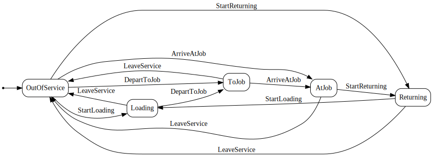

# Coldrun.Trucks.Api

### Quick start

```
dotnet run -c Release --project .\Coldrun.Trucks.Api\Coldrun.Trucks.Api.csproj
```

### Swagger URL

https://localhost:7224/swagger/index.html

### GraphQL URL

https://localhost:7224/graphql/

### Truck state&trigger diagram



### Sample REST API requests

[Coldrun.Trucks.Api/Coldrun.Trucks.Api.http](Coldrun.Trucks.Api/Coldrun.Trucks.Api.http)

### Sample GraphQL request

```graphql
{
    trucks(
        first: 3
        order: { name: DESC }
        where: { name: { startsWith: "T"}})
    {
        nodes
        {
            id
            code
            name
            status
            description
        }
    }
}
```